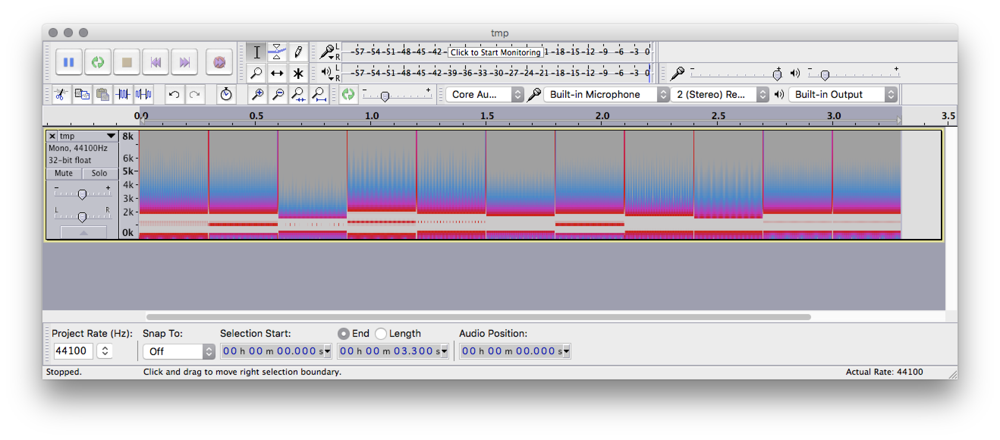

## Crunchtime

#### Writeup by hgarrereyn
* **Programming**
* *300 points*
* Being a pirate is all right with me. `nc challenge.uiuc.tf 11341` https://www.youtube.com/watch?v=pMhfbLRoGEw
* Files:
  * [encodeTones.py]()
* 5 Solves

# Solution

The file that we were provided does two things. First, it sends a randomly generated hex string over the tcp connection using some form of encoding (we'll get to that later). You must decode that string and send it back and then the program will send the flag over using the same encoding in multiple chunks. In order to continue recieving flag chunks, you have to verify each chunk just like the original string.

*In order to test my decoding scripts, I found it useful to save a message to disk instead of initiating a connection each time.*

Here is how I did that:

```python
# Initiate the connection
sock = remote('challenge.uiuc.tf', 11341)

# Get raw data (this takes a while)
raw = sock.recvline()

# Save the data
with open('tmp_raw', 'wb') as f:
	f.write(raw)
```

Then during testing:

```python
with open('tmp_raw', 'r') as f:
	raw = f.read()
```

The services may be offline, so I've included a datastring I previously saved: [**tmp_raw**]()

## Decoding

In the original file, we were provided with the following utitlity methods:

```python
def output_encode(np_array):
    return base64.b64encode(zlib.compress(np_array.tostring(), 9))

def output_decode(b64_string):
    return np.fromstring(zlib.decompress(base64.b64decode(b64_string)), dtype=np.float64)
```

So we see that the last stage of encoding simply takes an array and turns it into a base64 string. Now that we have the array, how do we obtain the initial 11 digit hexstring?

Here is where the encoding happens:

*Note the function name gives a handy hint that this is dual-tone multi-frequency signaling*

This is how most phones used to dial numbers (you can still hear tones on cellphones but it has no effect). See: https://en.wikipedia.org/wiki/Dual-tone_multi-frequency_signaling.

```python
sample_rate = 44100
number_of_digits = 11

tone_samples = int(0.3*sample_rate)
tone_time = np.linspace(0, tone_samples/sample_rate, tone_samples, endpoint=False)
lower_band = np.array([697, 770, 852, 941])
upper_band = np.array([1209, 1336, 1477, 1633])

[lower_band, upper_band] = np.meshgrid(upper_band, lower_band)

tone_ordering = np.array([['1','2','3','A'],['4','5','6','B'],['7','8','9','C'],['E','0','F','D']])

def find_character_index_tuple(character):
    inter = np.where(tone_ordering==character)
    return (inter[0][0], inter[1][0])

def encode_hex_string_as_dtmf(hexstring):
    if(len(hexstring) != number_of_digits):
        print("You lied to me!")
        exit(-1)

    master_indices = []
    for char in hexstring:
        master_indices.append(find_character_index_tuple(char))

    encoded = np.zeros(tone_samples * number_of_digits, dtype=np.float64)

    for i in range(number_of_digits):
        tone_start = i*tone_samples
        tone_end = (i+1)*tone_samples
        indices = master_indices[i]
        encoded[tone_start:tone_end] += 0.5*np.sin(2*np.pi*lower_band[indices[0],indices[1]]*tone_time + np.random.uniform(0,2*np.pi))
        encoded[tone_start:tone_end] +=  0.5*np.sin(2*np.pi*upper_band[indices[0],indices[1]]*tone_time + np.random.uniform(0,2*np.pi))

    return encoded
```

Specifically, notice:

```python
encoded[tone_start:tone_end] += 0.5*np.sin(2*np.pi*lower_band[indices[0],indices[1]]*tone_time + np.random.uniform(0,2*np.pi))
encoded[tone_start:tone_end] += 0.5*np.sin(2*np.pi*upper_band[indices[0],indices[1]]*tone_time + np.random.uniform(0,2*np.pi))
```

For each hex character, the program allocates a section of the array where it adds two sin waves. These two sine waves are set at a frequency determined by the character's position in the `tone_ordering` matrix.

Therefore, in order to decode the signal, we must take each segment and determine what (two) frequencies are present. Then we can cross reference those frequencies with the `lower_band` and `upper_band` lists and determine the index of the character in the `tone_ordering` matrix.

I wrote some saved data to a wav file in order to visualize the tones:

[**tmp.wav**]()



Notice how there are 11 distinct chunks each with two tones. We need to be able to determine these frequencies given the raw waveform data.

The function we are looking for is called the *Fourier Transform* which is a function that translates a signal into the frequencies that make it up. *Specifically, I will use the fft.fft implementation in the numpy package*


# Script
Here is my python implementation:

[**solveCrunchtime.py**]()
```python
# By Harrison Green <hgarrereyn>

from pwn import *

import base64, zlib
import numpy as np

# ===== Variables and functions provided by encodeTones.py

sample_rate = 44100
number_of_digits = 11

tone_samples = int(0.3*sample_rate)
tone_time = np.linspace(0, tone_samples/sample_rate, tone_samples, endpoint=False)
lower_band = np.array([697, 770, 852, 941])
upper_band = np.array([1209, 1336, 1477, 1633])

tone_ordering = np.array([['1','2','3','A'],['4','5','6','B'],['7','8','9','C'],['E','0','F','D']])

def output_decode(b64_string):
    return np.fromstring(zlib.decompress(base64.b64decode(b64_string)), dtype=np.float64)

# ===== End provided

# This takes a numpy array and returns the 11 character hexstring
def decode_val(data):
	# hexstring
	s = ''

	for i in range(number_of_digits):
		# these define the section of the array to check
		tone_start = i * tone_samples
		tone_end = tone_start + tone_samples

		# section of the array that corresponds to exactly one character
		dat = data[tone_start:tone_end]

		# perform a fourier transform on the data and calculate
		# the frequencies from the nuber of samples
		fft = np.fft.fft(dat)
		freq = np.fft.fftfreq(tone_samples)

		# Define a threshold and find the peaks of the fft plot.
		#
		# Then mask the frequencies array to determine which frequencies
		# those peaks correspond to.
		thresh = 0.75 * max(abs(fft))
		mask = abs(fft) > thresh
		peaks = freq[mask] * sample_rate

		# The fft function is working with imaginary numbers while we only
		# provided real float values. Therefore, it will return both positive
		# and negative frequencies corresponding to clockwise and counter-clockwise
		# waveforms.
		#
		# We just select the positive frequencies
		tones = peaks[np.where(peaks > 0)]

		# determine the lower tone and the higher tone (of the two frequencies
		# that we found)
		lower_tone = min(tones)
		higher_tone = max(tones)

		# Sometimes the frequencies won't be perfect so we just need to find
		# the closest match for each frequency and use that index.
		tone_index = (np.abs(lower_band - lower_tone).argmin(), np.abs(upper_band - higher_tone).argmin())

		# calculate the hex character
		val = tone_ordering[tone_index]

		# append to string
		s += val

	return s


# open the connection
sock = remote('challenge.uiuc.tf', 11341)

print('Verification...')

raw = sock.recvline()
data = output_decode(raw[2:-1]) # strip away enclosing characters
s = decode_val(data)
sock.sendline(s)

print('Getting flag...')

flag = ""

while True:
	raw = sock.recvline()
	if (!raw):
		break

	data = output_decode(raw[2:-1])
	s = decode_val(data)
	sock.sendline(s)

	print('Got chunk: ' + s)
	flag += s

print('Flag: ' + flag)
```

Flag: `14849EEF3E644B852F7F4A4836C03EDEEDEF8D7BEAEDA2AEA774AB47F8202A4549A76C0B591E5BF840F0AE96106100C83B0911C1479DBD666C61677B49276D5F6633336C696E675F307831367D`
